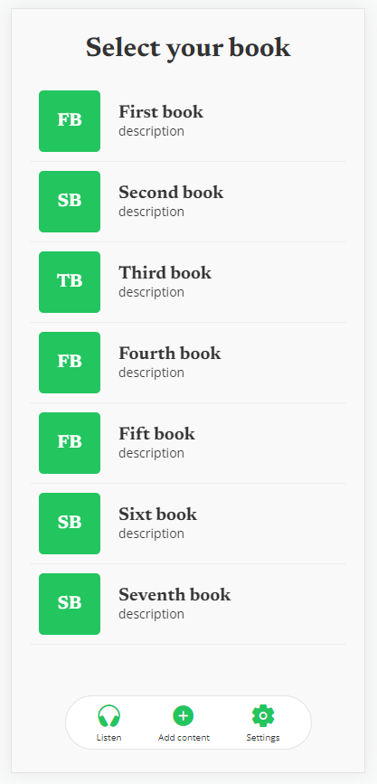

# Trellis UI
This repository contains the source code for Trellis created on React Native and Expo.



## Prerequisites

Make sure you have the following installed on your system before getting started:

- [Node.js](https://nodejs.org/) (recommended version)
- [npm](https://www.npmjs.com/) (installed with Node.js)
- [Expo CLI](https://docs.expo.dev/workflow/expo-cli/) (installed globally)

## Installation

1. Clone this repository on your local machine:

```bash
git clone https://github.com/your-username/your-repository.git
```

2. Navigate to the project directory:

```bash
cd your-repository
```

3. Install project dependencies:

```bash
npm install
```

## Getting Started

1. Start the Expo Application
```bash
npm start
```
2. When the application is compiled, a new window will show diferent options in which you can open your application. 

- Press w key to open the application in your browser
- Scan the QR code with the Expo Go app on your mobile device, or use an emulator on your computer to test the app.

## Project Structure
**App.js:** Entry point of the application.

**src/:** Folder containing the application's source files.

**assets/:** Folder to store resources such as images and fonts.

**components/:** Folder for reusable components.

**screens/:** Folder for application screens.